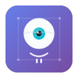

# Break Reminder Pro

<div align="center">



**Protect your eyes and health while working - completely free, no ads, no tracking**

[](https://opensource.org/licenses/MIT)
[](https://www.microsoft.com/windows)
[](https://github.com/SHTO88/break-reminder-pro)

[Download Latest Release](https://github.com/SHTO88/break-reminder-pro/releases) • [Report Bug](https://github.com/SHTO88/break-reminder-pro/issues) • [Request Feature](https://github.com/SHTO88/break-reminder-pro/issues)

</div>

## Why Your Eyes Need Break Reminder Pro

**Extended computer use is damaging your eyes and body.** Digital eye strain affects 50-90% of computer users, causing dry eyes, headaches, blurred vision, and neck pain. Break Reminder Pro helps you follow proven health practices like the **20-20-20 rule** to protect your vision and improve your well-being.

### 👁️ Protect Your Eyes & Health
- **Follow the 20-20-20 rule** - Every 20 minutes, look at something 20 feet away for 20 seconds
- **Prevent digital eye strain** - Reduce dry eyes, blurred vision, and headaches
- **Combat computer vision syndrome** - Protect against long-term eye damage
- **Improve posture** - Regular breaks prevent neck, shoulder, and back pain
- **Boost productivity** - Rested eyes and body work 23% more efficiently
- **Reduce fatigue** - Prevent the afternoon energy crash from screen overuse

### 🔒 Privacy First
- **No data collection** - Everything stays on your device
- **No tracking** - We don't know how you use the app
- **Works offline** - No internet connection required
- **Open source** - Full transparency, inspect the code yourself

### 💰 Completely Free
- **No ads** - Clean, distraction-free experience
- **No premium features** - Everything is included
- **No subscriptions** - Download once, use forever
- **No hidden costs** - Truly free software

## Features

### 👁️ Eye Care & Health
- **20-20-20 rule support** - Default 20-minute intervals, fully customizable
- **Digital eye strain prevention** - Regular breaks reduce dry eyes, headaches, and blurred vision
- **Posture improvement** - Reminders help prevent neck and back pain from prolonged sitting
- **Fatigue reduction** - Prevent afternoon energy crashes from screen overuse
- **Productivity boost** - Rested eyes and body work more efficiently
- **Long-term eye health** - Protect against computer vision syndrome

### 🎯 Smart Break Management
- **Eye-friendly break modes** - Choose what works best for your health:
  - 🔴 **Force Break** - Fullscreen reminder that forces you to look away (best for eye health)
  - 🔔 **Notification** - Gentle popup reminder to rest your eyes
  - 🔒 **Lock Screen** - Automatically lock computer to enforce break time
- **All-day protection** - Continuous break cycles throughout your workday
- **Gentle preparation** - Pre-break warnings so you can finish your thought
- **Custom timing** - Adjust intervals to match your work style and eye care needs

### 🧠 Intelligent Features
- **Meeting detection** - Automatically detects video calls and postpones breaks
- **Auto-pause media** - Pauses music/videos during break time
- **Break chimes** - Optional audio notifications when breaks start/end
- **Smart timing** - Adapts to your workflow patterns

### 🖥️ System Integration
- **System tray** - Runs quietly in the background
- **Auto-start** - Launches with Windows (optional)
- **Hide to tray** - Minimize instead of closing
- **Native feel** - Follows Windows design guidelines
- **Automatic updates** - Get notified when new versions are available

## Perfect For

- **Office workers** - Combat computer vision syndrome and repetitive strain
- **Developers** - Prevent programmer's eye strain during long coding sessions
- **Students** - Maintain focus and eye health during study marathons
- **Remote workers** - Structure your day with healthy break habits
- **Gamers** - Protect your vision during extended gaming sessions
- **Digital artists** - Preserve eye health during detailed creative work
- **Data analysts** - Rest your eyes from spreadsheets and dashboards
- **Anyone** - Who follows the 20-20-20 rule or wants to start

## Screenshots

### Main Interface
*Clean, simple interface focused on eye health*

### Break Notification
*Gentle reminders that protect your vision*

### Force Break Mode
*Fullscreen breaks for maximum eye health benefit*

## Installation

### Option 1: Microsoft Store (Recommended)
*Coming Soon - Currently in review*

### Option 2: Direct Download
1. Visit [Releases](https://github.com/SHTO88/break-reminder-pro/releases)
2. Download the latest `.msi` installer
3. Run installer and follow setup wizard
4. Launch from Start Menu or Desktop

### System Requirements
- Windows 10 (version 1903+) or Windows 11
- 50MB RAM (lightweight!)
- 20MB disk space
- No admin permissions required

## How It Works

1. **Set your eye care schedule** - Start with 20-minute intervals (20-20-20 rule)
2. **Choose your break style** - Force Break mode is best for eye health
3. **Enable smart features** - Meeting detection and media pause
4. **Protect your eyes** - The app handles the rest automatically

Break Reminder Pro runs quietly in your system tray, tracking your screen time and gently reminding you when it's time to rest your eyes. Smart features ensure you're never interrupted during important meetings or calls.

## The Science Behind Breaks

### Digital Eye Strain Facts
- **50-90%** of computer users experience digital eye strain
- **Blue light exposure** can disrupt sleep patterns and cause eye fatigue
- **Reduced blink rate** (from 15-20 to 5 blinks per minute) causes dry eyes
- **Poor posture** from screen use causes neck and shoulder pain

### 20-20-20 Rule Benefits
- **Relaxes focusing muscles** - Prevents eye muscle fatigue
- **Increases blink rate** - Naturally moisturizes eyes
- **Reduces accommodation stress** - Gives eyes a break from close-up work
- **Improves circulation** - Movement during breaks helps overall health

## What Users Say

> "My eye strain headaches are gone! The 20-20-20 reminders actually work."

> "Finally, a break reminder that understands the importance of eye health, not just productivity."

> "Love that it's free and doesn't track me. Just pure eye care focus."

> "The meeting detection is brilliant - no more awkward interruptions during video calls."

## Privacy Promise

Your privacy is not negotiable. Break Reminder Pro:
- ✅ Never collects personal data
- ✅ Never tracks your usage
- ✅ Never sends data anywhere
- ✅ Works completely offline
- ✅ Stores settings only on your device
- ✅ Is fully open source for transparency

## Support & Community

- 🐛 **Found a bug?** [Report it here](https://github.com/SHTO88/break-reminder-pro/issues)
- 💡 **Have an idea?** [Suggest a feature](https://github.com/SHTO88/break-reminder-pro/issues)
- 💬 **Need help?** [Start a discussion](https://github.com/SHTO88/break-reminder-pro/discussions)
- 🤝 **Want to contribute?** See [Contributing Guide](CONTRIBUTING.md)

## License

Break Reminder Pro is open source software licensed under the [MIT License](LICENSE). This means:
- ✅ Free for personal and commercial use
- ✅ Modify and distribute freely
- ✅ No warranty or liability

---

## Technical Details

<details>
<summary>For developers and technical users</summary>

### Built With
- **Framework**: Tauri 2.0 (Rust backend + Web frontend)
- **Backend**: Rust for system integration and performance
- **Frontend**: Vanilla JavaScript, HTML5, CSS3
- **Build System**: Tauri CLI with npm scripts

### Architecture
- **System Integration**: Native Windows APIs for tray, autostart, media control
- **Meeting Detection**: Process monitoring + browser window title analysis
- **Settings Storage**: Local JSON files via Tauri store plugin
- **Window Management**: Multiple webview windows for different break modes

### Development Setup

#### Prerequisites
- [Node.js](https://nodejs.org/) (v18+)
- [Rust](https://www.rust-lang.org/tools/install)
- [Tauri CLI](https://tauri.app/v2/guides/getting-started/prerequisites/)

#### Quick Start
```bash
git clone https://github.com/SHTO88/break-reminder-pro.git
cd break-reminder-pro
npm install
cd src-tauri && cargo build && cd ..
npm run dev
```

#### Build Commands
- `npm run dev` - Development with hot reload
- `npm run dev-fast` - Fast development build
- `npm run build` - Production MSI installer
- `npm run build-debug` - Debug build for testing

### Project Structure
```
break-reminder-pro/
├── src/                 # Frontend (HTML, CSS, JS)
├── src-tauri/          # Backend (Rust)
│   ├── src/lib.rs      # Main application logic
│   ├── icons/          # Application icons
│   └── Cargo.toml      # Rust dependencies
├── .github/            # GitHub templates
└── docs/               # Documentation
```

### Key Dependencies
- `tauri` - Main framework with tray-icon feature
- `tauri-plugin-store` - Settings persistence
- `tauri-plugin-autostart` - Windows startup integration
- `enigo` - Media control via keyboard simulation
- `sysinfo` - Process detection for meeting awareness
- `winapi` - Windows-specific APIs

### Update System
- **Automatic checking** - Checks for updates daily (can be disabled)
- **Manual updates** - Check for updates anytime in Settings
- **GitHub releases** - Downloads from official GitHub releases
- **User control** - You decide when to download and install
- **No auto-install** - Manual download for security

### Contributing
See [CONTRIBUTING.md](CONTRIBUTING.md) for development guidelines, code style, and how to submit changes.

### Creating Releases
See [docs/RELEASE_GUIDE.md](docs/RELEASE_GUIDE.md) for instructions on creating new releases.

</details>

---

<div align="center">

**Made with ❤️ for healthier eyes and better work habits**

[⭐ Star this project](https://github.com/SHTO88/break-reminder-pro) if it helps protect your vision!

</div>